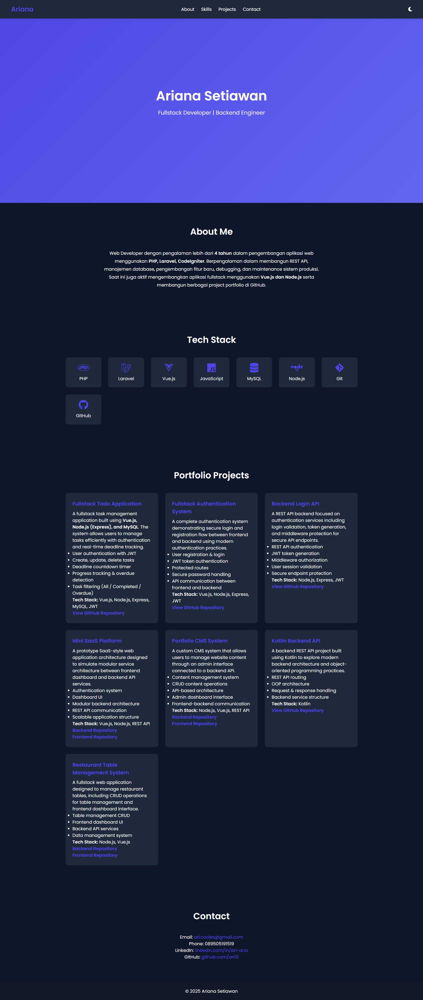

# Personal Portfolio Website

## 📌 Overview
This is a modern personal portfolio website built using **HTML, CSS, and JavaScript** to showcase my experience, skills, and projects as a Fullstack Developer.

The website highlights my professional background, technical stack, and multiple real-world projects with clean UI design and responsive layout.

---

## 🚀 Features
- Clean and modern UI design
- Responsive layout (mobile friendly)
- Dark mode toggle
- Smooth scrolling navigation
- Project showcase section
- Contact information section

---

## 🛠️ Tech Stack
- HTML5
- CSS3
- JavaScript
- Font Awesome
- Google Fonts

---

## 📷 Preview

---

## 📂 Project Structure